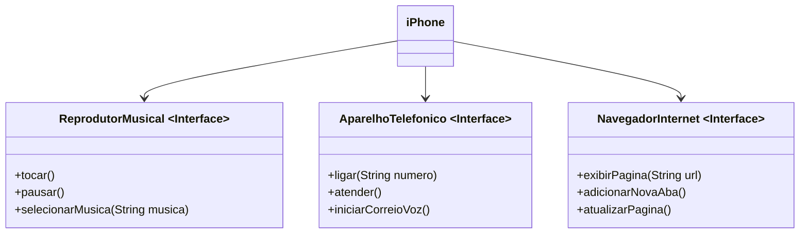

### Diagrama UML (Mermaid)

```mermaid
classDiagram
    class `ReprodutorMusical ~Interface~` {
        +tocar()
        +pausar()
        +selecionarMusica(String musica)
    }

    class `AparelhoTelefonico ~Interface~`{
        +ligar(String numero)
        +atender()
        +iniciarCorreioVoz()
    }

    class `NavegadorInternet ~Interface~`{
        +exibirPagina(String url)
        +adicionarNovaAba()
        +atualizarPagina()
    }

    class iPhone {
    }

    iPhone --> `ReprodutorMusical ~Interface~`
    iPhone --> `AparelhoTelefonico ~Interface~`
    iPhone --> `NavegadorInternet ~Interface~`
```
